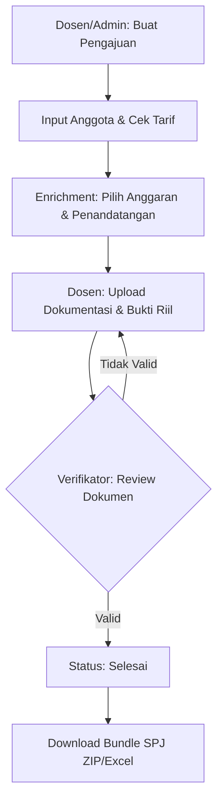

# SISPERDIN POLSRI

**Sistem Informasi Perjalanan Dinas** (SISPERDIN) adalah platform manajemen administrasi perjalanan dinas yang dirancang khusus untuk **Politeknik Negeri Sriwijaya**. Sistem ini mengotomatisasi proses dari pengajuan, pendataan bukti perjalanan, verifikasi oleh bagian keuangan, hingga pembuatan dokumen SPJ (Surat Pertanggungjawaban) secara otomatis.

Sistem ini terintegrasi dengan ekosistem **Polsri Pay** untuk sinkronisasi data pegawai dan manajemen honorarium.

---

## 🚀 Teknologi yang Digunakan

### Backend (Server-side)
- **Framework:** [CodeIgniter 4.7](https://codeigniter.com/) (PHP ^8.2)
- **Authentication:** [CodeIgniter Shield](https://github.com/codeigniter4/shield) (Session based)
- **Document Generators:**
  - [PhpSpreadsheet](https://github.com/PHPOffice/PhpSpreadsheet) (Excel templates for control lists, nominative lists, etc.)
  - [Dompdf](https://github.com/dompdf/dompdf) (PDF generation for statements and SPD)
  - [PhpWord](https://github.com/PHPOffice/PHPWord) (Word template processing)

### Frontend (Client-side)
- **Styling:** Tailwind CSS (Modern & Responsive UI)
- **Icons:** [Lucide Icons](https://lucide.dev/)
- **Interactivity:**
  - [SweetAlert2](https://sweetalert2.github.io/) (Popups & Confirmations)
  - [Alpine.js](https://alpinejs.dev/) / Vanilla JS
- **Fonts:** Inter & Outfit (Google Fonts)

---

## ✨ Fitur Utama

- **Dashboard Statistik:** Visualisasi data pengajuan aktif, selesai, dan total anggaran.
- **Manajemen Perjalanan (Perjadin):**
  - Pengajuan Surat Tugas secara digital.
  - Multi-member (Satu surat tugas untuk banyak personil).
  - Pengecekan Tarif otomatis berdasarkan tujuan dan tingkat biaya.
- **Enrichment Data:** Pengisian detail anggaran, pemilihan PPK, dan Bendahara secara spesifik per pengajuan.
- **Kelengkapan Dokumen:**
  - Checklist dokumen wajib (Surat Tugas, Tiket, Boarding Pass, dll).
  - Upload dokumentasi kegiatan dan laporan naratif.
- **Workflow Verifikasi:** Proses review bertahap oleh Verifikator Keuangan untuk memastikan dokumen valid sebelum dana cair.
- **Bundle SPJ Dinamis:** Fitur export ZIP yang berisi seluruh dokumen pendukung (SPD, Rincian Biaya, Surat Pernyataan, Daftar Kontrol) dalam format PDF dan Excel.

---

## 👥 Sistem Role (Aksesibilitas)

Sistem ini menggunakan pembagian akses yang ketat (RBAC):

1. **Superadmin / Admin Kepegawaian**
   - Mengelola data Master Pegawai (Sync dari API Polsri Pay).
   - Mengelola data User & Hak Akses.
   - Mengelola Daftar Penandatangan (PPK, Bendahara, Direktur).
   - Monitoring seluruh pengajuan perjalanan dinas.
   
2. **Dosen / Staff (Lecturer)**
   - Mengajukan surat tugas untuk diri sendiri atau grup.
   - Melengkapi dokumentasi pasca-perjalanan.
   - Mengunduh blanko kosong dan dokumen mandiri.

3. **Verifikator (Keuangan)**
   - Melakukan verifikasi kelengkapan dokumen yang diunggah dosen.
   - Menyetujui atau menolak (Reject) dengan catatan revisi.
   - Mengunduh Bundle SPJ lengkap untuk arsip pencairan.

---

## 🔄 Alur Kerja (Workflow)



---

## 🛠️ Cara Instalasi & Menjalankan

### Persyaratan Sistem
- PHP 8.2 ke atas
- MySQL 8.0 / MariaDB 10.4+
- Composer
- Node.js (untuk compile Tailwind CSS)

### Langkah Instalasi

1. **Clone Repository**
   ```bash
   git clone [url-repo]
   cd perjadin
   ```

2. **Install Dependencies**
   ```bash
   composer install
   npm install
   ```

3. **Konfigurasi Environment**
   Salin file `.env.example` ke `.env` dan sesuaikan pengaturan database serta Base URL:
   ```bash
   cp .env.example .env
   # Edit .env menggunakan editor favorit Anda
   ```

4. **Migrasi Database**
   Jalankan migrasi untuk membuat struktur tabel:
   ```bash
   php spark migrate:all
   ```

5. **Generate Assets** (Tailwind Build)
   ```bash
   npm run css:build
   ```

6. **Jalankan Aplikasi**
   ```bash
   php spark serve
   ```
   Akses di `http://localhost:8080`.

---

## 📝 Catatan Pengembangan
- **Compile CSS:** Gunakan `npm run css:watch` saat masa pengembangan untuk mendeteksi perubahan class Tailwind secara real-time.
- **Struktur Folder:**
  - `app/Libraries/Templates`: Logika pembuatan template dokumen (Excel/PDF).
  - `app/Views`: Seluruh interface menggunakan komponen Blade-like milik CI4.
  - `public/uploads`: Lokasi penyimpanan file dokumentasi dan lampiran.

---

© 2026 Politeknik Negeri Sriwijaya - Polsri Pay Ecosystem.
