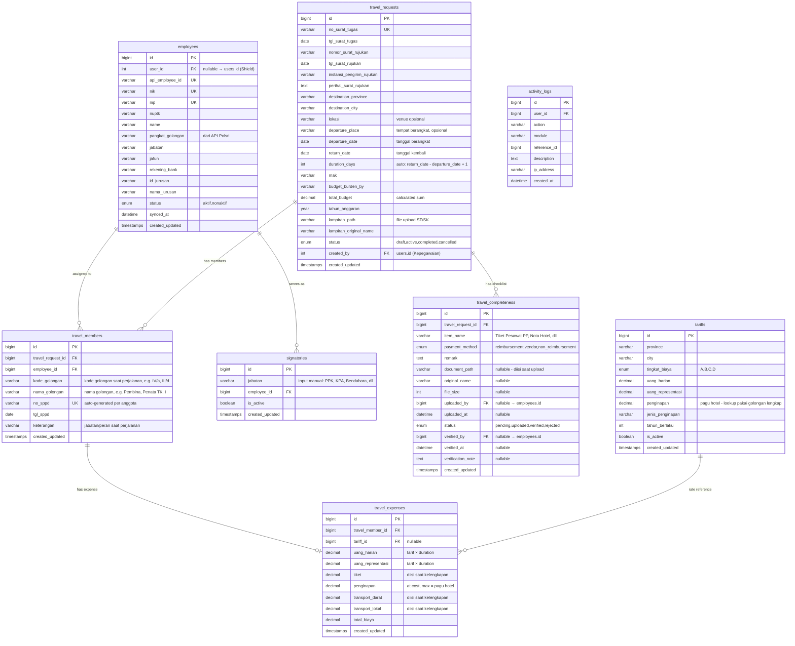
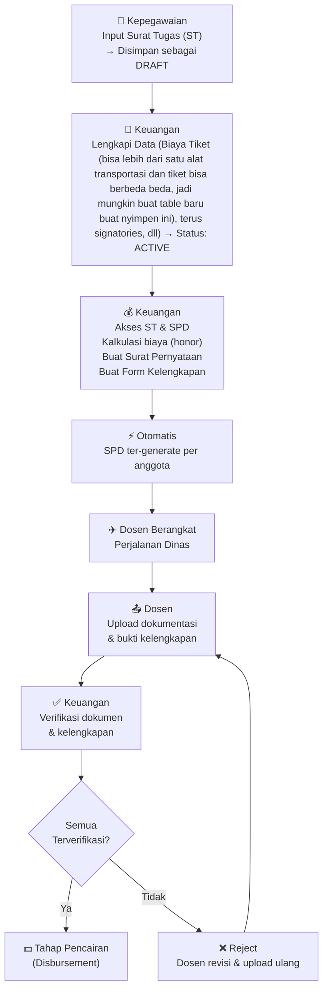
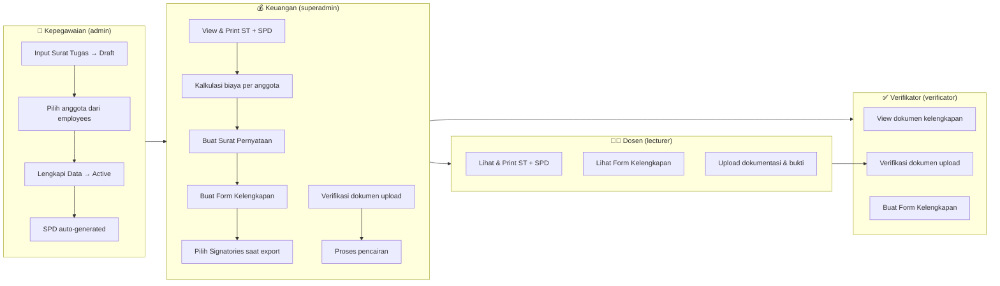
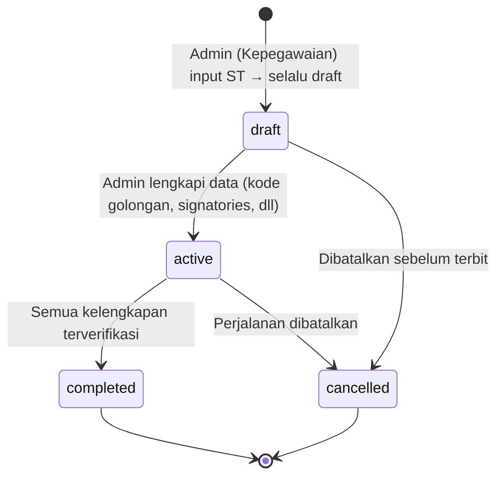
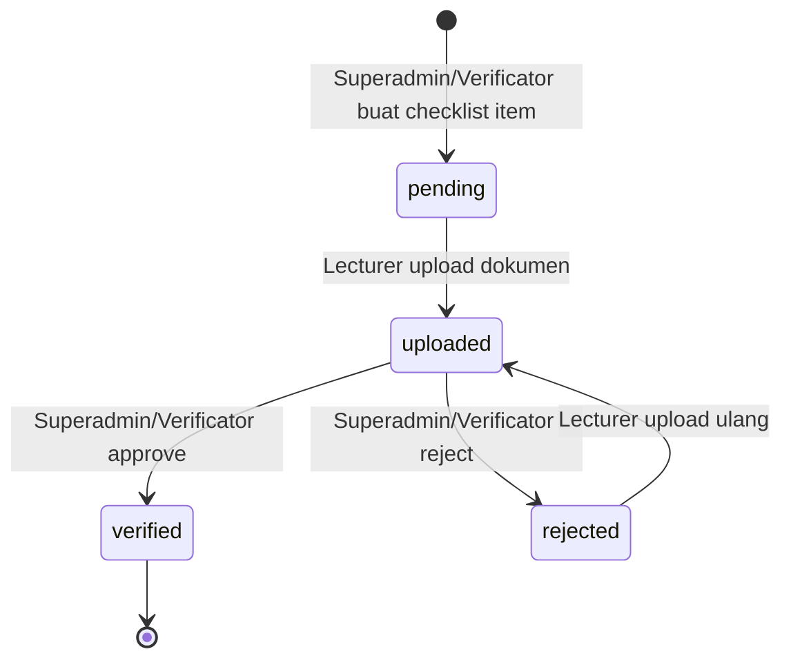

# 🚀 PERJADIN — Complete Implementation Guide

> **Sistem Perjalanan Dinas — Politeknik Negeri Sriwijaya**
> Guide for self-directed, best-practice development with AI as a tool.

---

## 📋 Table of Contents


---

## 1. Prasyarat & Environment Setup

### Software yang Dibutuhkan

| Software | Minimum Version | Tujuan |
|---|---|---|
| PHP | 8.1+ | CI4 requirement |
| Composer | 2.x | Dependency manager |
| MySQL | 8.0+ / MariaDB 10.4+ | Database |
| Node.js | 18+ | TailwindCSS CLI build |
| Git | 2.x | Version control |
| VS Code / PHPStorm | Latest | IDE |

### Recommended VS Code Extensions

- **PHP Intelephense** — autocomplete & linting
- **PHP Debug** — Xdebug integration
- **Tailwind CSS IntelliSense** — TailwindCSS autocomplete
- **GitLens** — Git history & blame
- **EditorConfig** — consistent formatting
- **REST Client** — test API tanpa Postman

### PHP Extensions (Wajib)

```ini
; php.ini — pastikan extension ini aktif
extension=intl
extension=mbstring
extension=json
extension=mysqlnd
extension=curl
extension=gd        ; untuk image processing jika perlu
extension=zip       ; untuk PhpSpreadsheet
```

---

## 4. Database Design (Revised v3 — Current Implementation)

> **Revisi terbaru** per 11/03/2026. Semua migration sudah dijalankan.
> Perubahan kumulatif dari v1 → v2 → v3:
> - **Hapus tabel `travel_documents`** — digabung ke `travel_completeness`
> - **Tambah tabel `travel_members`** — pisahkan konsep "anggota perjalanan" dari "rincian biaya"
> - **Hapus `no_sppd`/`tgl_sppd`** dari `travel_requests` → pindah ke `travel_members` (setiap anggota punya SPPD sendiri)
> - **Hapus `employee_id`** dari `travel_requests` (ST bukan milik 1 orang, dibuat oleh Kepegawaian untuk grup)
> - **Hapus `surat_dasar`, `purpose`, `task_detail`** — diganti dengan field rujukan terstruktur
> - **Tambah field surat rujukan**: `nomor_surat_rujukan`, `tgl_surat_rujukan`, `instansi_pengirim_rujukan`, `perihal_surat_rujukan`
> - **Surat Tugas (ST) = lampiran upload** bukan dokumen yang di-generate. Field: `lampiran_path`, `lampiran_original_name`
> - **Gunakan `departure_date`/`return_date`** — tanggal berangkat & kembali sesuai ST, auto-hitung `duration_days`. Kolom `tgl_mulai`/`tgl_selesai` sudah di-drop (migration `DropTglMulaiSelesaiFromTravelRequests`).
> - **Tambah `kode_golongan` + `nama_golongan`** di `travel_members` — snapshot kode golongan (IV/a, III/d) dan nama golongan (Pembina, Penata TK. I) saat perjalanan. Kode angka (IV, III) tetap di `employees.pangkat_golongan` dari API.
> - **Signatories lebih fleksibel** — `role_type` ENUM → `jabatan` VARCHAR (input manual)
> - **Role tetap 4 group**: `superadmin` (Keuangan), `admin` (Kepegawaian), `verificator` (Verifikator), `lecturer` (Dosen)

### Konsep Golongan & Tingkat Biaya

Golongan PNS/Dosen memiliki dua level:

| Kode | Kode Angka | Nama | Tingkat Biaya |
|---|---|---|---|
| IV/e | IV | Pembina Utama | A |
| IV/d | IV | Pembina Utama Madya | A |
| IV/c | IV | Pembina Utama Muda | A |
| IV/b | IV | Pembina TK. I | A |
| IV/a | IV | Pembina | A |
| III/d | III | Penata TK. I | B |
| III/c | III | Penata | B |
| III/b | III | Penata Muda TK. 1 | B |
| III/a | III | Penata Muda | B |

**Dua jenis lookup tarif:**

1. **Uang Harian & Representasi** → lookup pakai `tingkat_biaya` (A/B/C/D) yang dipetakan dari kode angka (IV→A, III→B, II→C, I→D)
2. **Pagu Hotel (Penginapan)** → lookup pakai golongan lengkap (IV/a, III/d, dll) karena pagu berbeda per sub-golongan. Misal: Gol III/d punya pagu hotel lebih tinggi dari III/a.

**Pagu Hotel (At Cost + Plafon):**
- Dibayar sesuai bukti kuitansi riil (at cost)
- Tapi dibatasi oleh pagu maksimum per malam
- Contoh: Pagu III di Jakarta = Rp 800.000 → hotel Rp 600.000 di-reimburse Rp 600.000, hotel Rp 1.000.000 di-reimburse cuma Rp 800.000
- Besaran mengacu SBM (Standar Biaya Masukan) Kementerian Keuangan per tahun
- Variabel: Provinsi Tujuan × Golongan Lengkap

**Kenapa `kode_golongan` & `nama_golongan` disimpan di `travel_members`:**
- Data `employees.pangkat_golongan` berasal dari API Polsri (berisi kode angka, e.g. IV, III) dan bisa berubah kapan saja saat sync
- `travel_members.kode_golongan` = snapshot kode golongan lengkap (e.g. IV/a, III/d) saat perjalanan, diisi saat form kelengkapan
- `travel_members.nama_golongan` = nama golongan (e.g. Pembina, Penata TK. I), diisi saat form kelengkapan
- Digunakan untuk: mapping tingkat_biaya (uang harian/representasi) dan lookup pagu hotel

### ERD Overview (v3 — Current)

### Analisis Masalah Desain Lama

| Masalah | Penjelasan | Solusi |
|---|---|---|
| `travel_requests.employee_id` | ST bukan milik 1 pegawai — dibuat Kepegawaian untuk grup. Ambigu: initiator atau ketua? | Hapus. Ganti dengan `created_by` (user Kepegawaian) |
| `travel_requests.no_sppd` | SPPD diterbitkan PER ANGGOTA, bukan per request. Lihat format surat real. | Pindahkan ke `travel_members` |
| `travel_expenses` double-duty | Berfungsi sebagai bridge table (anggota) DAN data biaya sekaligus. Membingungkan. | Pisah: `travel_members` (anggota) + `travel_expenses` (biaya per anggota) |
| `travel_documents` redundan | Overlap dengan `travel_completeness` — keduanya track dokumen/requirement. | Hapus `travel_documents`, gabung ke `travel_completeness` |
| `signatories.role_type` ENUM terlalu kaku | Jabatan penandatangan bisa beragam (PPK, KPA, Bendahara, Kepala Bagian, dll). ENUM membatasi. | Ubah ke VARCHAR `jabatan` — input manual, lebih fleksibel |
| Signatory FK di `travel_requests` | Penandatangan dipilih saat export dokumen, bukan saat input ST. Tidak perlu FK permanen. | Hapus semua `signatory_*_id` dari `travel_requests` |
| Status workflow terlalu kompleks | `draft→pending→approved→verified→rejected→cancelled` tidak sesuai realita. | Simplify: `draft→active→completed→cancelled` |

### Role Mapping (Revised)

> Sesuai dengan `AuthGroups.php` yang sudah benar.

| Shield Group | Nama Display | Fungsi Utama |
|---|---|---|
| `superadmin` | Keuangan | Full access, kalkulasi biaya (honor), manage system |
| `admin` | Kepegawaian | Input ST, auto-generate SPD, kelola pegawai, master data |
| `verificator` | Verifikator (Keuangan) | Verifikasi dokumen & kelengkapan, buat form kelengkapan |
| `lecturer` | Dosen | Lihat & print ST/SPD, lihat form kelengkapan, upload dokumentasi |

### ERD Overview (v3 — Current)



### Tabel yang Dihapus

| Tabel Lama | Alasan Hapus | Pengganti |
|---|---|---|
| `travel_documents` | Redundan dengan `travel_completeness`. Keduanya track dokumen pendukung. | `travel_completeness` sekarang handle checklist + upload + verifikasi sekaligus |

### Tabel yang Ditambah

| Tabel Baru | Alasan | Relasi |
|---|---|---|
| `travel_members` | Setiap anggota punya SPPD sendiri. Perlu entitas terpisah dari expense. | FK ke `travel_requests` + `employees` |

### Dokumen yang Di-generate dari Data (tidak perlu tabel sendiri)

Berdasarkan format surat real dari Polsri:

| Dokumen | Sumber Data | Per |
|---|---|---|
| **Surat Tugas (ST)** | `travel_requests` + `travel_members` + `employees` | 1 per perjalanan |
| **SPD (Surat Perjalanan Dinas)** | `travel_members` + `employees` + `travel_requests` + `tariffs` | 1 per anggota |
| **Rincian Biaya Perjalanan Dinas** | `travel_expenses` + `travel_members` | 1 per anggota |
| **Kuitansi** | `travel_expenses` + `travel_members` + signatories | 1 per anggota |
| **Perhitungan SPPD Rampung** | `travel_expenses` | 1 per anggota |
| **Surat Pernyataan** | `travel_members` + `travel_requests` + signatories | 1 per anggota |
| **Daftar Kontrol Pembayaran (Nominatif)** | ALL `travel_members` + `travel_expenses` | 1 per perjalanan (summary) |

### Migrations Order (Revised)

1. `employees` — tidak ada FK
2. `signatories` — FK ke `employees`
3. `tariffs` — tidak ada FK
4. `travel_requests` — FK ke `users`
5. `travel_members` — FK ke `travel_requests`, `employees`
6. `travel_expenses` — FK ke `travel_members`, `tariffs`
7. `travel_completeness` — FK ke `travel_requests`, `employees`
8. `activity_logs` — FK ke `employees`
9. `ci_sessions` — untuk database session handler

---

## 5. System Workflow & Business Process

### Alur Utama Perjalanan Dinas (End-to-End)

> Berdasarkan hasil meeting Wadir 1 (09/03/2026)



### Workflow per Role



### Status Flow — Travel Request

> **Catatan**: ST selalu disimpan sebagai **draft** terlebih dahulu. Perubahan status `draft → active` dilakukan melalui fitur **"Lengkapi Data"** di halaman detail, bukan saat input ST.



### Status Flow — Travel Completeness (per item)



### Role Access Matrix

| Fitur | superadmin (Keuangan) | admin (Kepegawaian) | verificator (Verifikator) | lecturer (Dosen) |
|---|:---:|:---:|:---:|:---:|
| Input Surat Tugas | ✅ | ✅ | ❌ | ❌ |
| SPD auto-generate | ✅ | ✅ | ❌ | ❌ |
| View/Print ST & SPD | ✅ | ✅ | ✅ | ✅ |
| Kalkulasi biaya (honor) | ✅ | ❌ | ❌ | ❌ |
| Buat Surat Pernyataan | ✅ | ❌ | ❌ | ❌ |
| Buat Form Kelengkapan | ✅ | ❌ | ✅ | ❌ |
| Filter kelengkapan (reimburse/vendor/non) | ✅ | ❌ | ✅ | ❌ |
| View Form Kelengkapan | ✅ | ✅ | ✅ | ✅ |
| Upload dokumentasi | ❌ | ❌ | ❌ | ✅ |
| Verifikasi dokumen | ✅ | ❌ | ✅ | ❌ |
| Pilih Signatories (saat export) | ✅ | ❌ | ❌ | ❌ |
| CRUD Tariffs | ✅ | ✅ | ❌ | ❌ |
| CRUD Signatories | ✅ | ✅ | ❌ | ❌ |
| CRUD Employees | ✅ | ✅ | ❌ | ❌ |
| Sync API Pegawai | ✅ | ✅ | ❌ | ❌ |
| Print Daftar Nominatif | ✅ | ❌ | ✅ | ❌ |
| Print Rincian Biaya | ✅ | ❌ | ✅ | ✅ |
| Print Kuitansi | ✅ | ❌ | ✅ | ❌ |
| Dashboard & Reporting | ✅ | ✅ | ✅ | ❌ |

### Catatan Penting dari Meet Wadir 1

1. **SK tidak perlu diaplikasikan** di sistem, tapi bisa jadi lampiran saat pengajuan
2. **superadmin = Keuangan** (full access + kalkulasi), **verificator = Verifikator Keuangan** (pengecek dokumen)
3. **ST → SPD otomatis** — tidak perlu approval flow di sistem. Approval fisik di kertas.
4. **Form Kelengkapan** bisa dibuat sebelum ATAU sesudah perjalanan
5. **Tiket dll dipesan dari Poltek** — jadi banyak item kelengkapan pakai metode `vendor`
6. **Upload dari Dosen** terutama untuk bukti pengeluaran pribadi → `reimbursement`
7. **Signatories (pejabat penandatangan) dipilih saat export dokumen** (PDF/Excel), bukan saat input pengajuan. Jabatan diinput manual (VARCHAR), bukan pilihan tetap.
8. **ST selalu disimpan sebagai draft** — perubahan status `draft → active` dilakukan melalui fitur "Lengkapi Data" di halaman detail. Fitur ini mengisi: `kode_golongan` & `nama_golongan` per anggota, memilih signatories untuk SPD, dan mengaktifkan ST.

---

## 5b. Development Phases & Checklist (Revised)

### PHASE 1: Foundation ✅

- [x] Install CI4 via Composer
- [x] Setup `.env` (database, base URL, environment)
- [x] Setup TailwindCSS CLI + build script
- [x] Buat database migrations
- [x] Jalankan `php spark migrate`
- [x] Buat **Seeder** untuk data dummy (admin user, sample tariffs)
- [x] Setup **base layout** (`app/Views/layouts/main.php`) dengan sidebar + navbar
- [x] Buat halaman login

### PHASE 2: Authentication & Authorization ✅

- [x] Install & setup `codeigniter4/shield`
- [x] Setup route groups dengan filter `session` + `group:*`
- [x] Integrasikan tabel `employees` ke `users` (Shield) via `employees.user_id`
- [x] Seed akun admin awal + assign group
- [x] Test login/logout flow

### PHASE 3: API Integration & Data Sync ✅

- [x] Buat `PolsriApiService`
- [x] Implement `CURLRequest` dengan API key header
- [x] Buat `SyncController` untuk sinkronisasi manual
- [x] Mapping response API → tabel `employees`
- [x] Handle conflict (update existing vs insert new)
- [x] Buat CLI command: `php spark sync:employees`
- [x] Test dengan data real dari API

### PHASE 4: Master Data Management ✅

- [x] CRUD **Tariffs** — form + tabel + pagination
- [x] CRUD **Signatories** — pilih dari employees, jabatan VARCHAR (input manual)
- [x] CRUD **Employee Management** — view list, edit role, toggle status
- [ ] Import tarif dari Excel (via PhpSpreadsheet) — optional
- [ ] **TODO**: Tambah tarif pagu hotel per golongan lengkap (III/a, III/b, dst.)

### PHASE 5: Database Migration Revision ✅

- [x] Buat migration: `travel_members` table (ReviseSchemaV2)
- [x] Revisi migration: `travel_requests` — hapus `employee_id`, `no_sppd`, `tgl_sppd`, `surat_dasar`, `purpose`, `task_detail`, `precautions`, `origin`, `destination`
- [x] Tambah field: `nomor_surat_rujukan`, `tgl_surat_rujukan`, `instansi_pengirim_rujukan`, `perihal_surat_rujukan`, `lokasi`, `tahun_anggaran`, `lampiran_path`, `lampiran_original_name`
- [x] Drop kolom redundan `tgl_mulai`/`tgl_selesai` — gunakan `departure_date`/`return_date` yang sudah ada (migration `DropTglMulaiSelesaiFromTravelRequests`)
- [x] Revisi: `travel_expenses` — ganti FK `travel_request_id` + `employee_id` → `travel_member_id`
- [x] Revisi: `travel_completeness` — tambah kolom upload & verifikasi
- [x] Revisi: `signatories` — ganti `role_type` ENUM → `jabatan` VARCHAR
- [x] Tambah `kode_golongan` + `nama_golongan` di `travel_members` — snapshot golongan saat perjalanan
- [x] Semua migration sudah dijalankan (`php spark migrate`)

### PHASE 6: Travel Request Module (Core) ✅

- [x] `TravelRequestController` — full CRUD (store, show, edit, update, destroy)
- [x] Form input Surat Tugas (ST): create.php & edit.php
  - Section 1: Data Dasar (no ST, tgl ST, provinsi/kota tujuan, tempat berangkat, tgl berangkat/kembali)
  - Section 2: Surat Rujukan (nomor, tanggal, instansi, perihal, lokasi, beban anggaran, lampiran ST upload)
  - Section 3: Anggota Perjalanan (multi-select Tom Select + filter golongan/jurusan)
- [x] Surat Tugas = lampiran upload (bukan dokumen generate). Field: `lampiran_path`, `lampiran_original_name`
- [x] **ST selalu disimpan sebagai draft** — tidak ada tombol "Aktifkan Langsung". Redirect ke halaman detail setelah simpan.
- [x] Role visibility:
  - Admin/Superadmin: CRUD full, download SPD (semua status)
  - Lecturer: View & download jika termasuk anggota
- [x] `TravelMemberModel` — bridge table with employee join
- [x] Status: `draft → active → completed → cancelled`
- [x] Auto-calculate `duration_days` dari `departure_date`/`return_date`
- [x] `TravelExpenseCalculator` — lookup tarif otomatis per anggota (tingkat_biaya dari golongan)
- [x] Saat input ST: hanya hitung `uang_harian` + `uang_representasi`. Penginapan/tiket/transport = 0 (diisi saat kelengkapan)
- [x] Detail page (show.php):
  - Info dokumen, surat rujukan, tujuan & jadwal (termasuk tempat berangkat), anggota tim + biaya
  - Sidebar: download lampiran ST, download SPD (.docx) — selalu tersedia (termasuk saat draft)
  - Tombol "Lengkapi Data" (placeholder) menggantikan tombol "Aktifkan" — akan menuju form kelengkapan
  - Signatory selects (KPA/PPK) dihapus dari show.php — dipindah ke form kelengkapan

### PHASE 7: Document Generation (Partial) ✅

- [x] Template **SPD (Surat Perjalanan Dinas)** → docx via PhpWord (SppdTemplate.php)
  - Format 10 baris numbered: PPK, Nama/NIP, Pangkat+Golongan+Jabatan+Tingkat Biaya, Maksud, Alat Angkutan, Tempat Berangkat/Tujuan, Waktu Perjalanan, Pengikut, Pembebanan Anggaran, Keterangan
  - Satu halaman per anggota (multi-page jika banyak member)
  - PPK auto-resolved dari signatories aktif (jabatan LIKE 'PPK')
  - Tanggal format Indonesia (dd NamaBulan YYYY)
  - Transport label: udara→Pesawat, darat→Mobil, laut→Kapal
  - Tanda tangan PPK di kanan bawah (Dikeluarkan di, Pada Tanggal, Nama, NIP)
  - SPD tersedia untuk download di semua status (termasuk draft)
- [x] Download lampiran ST (uploaded file)
- [ ] Template **Rincian Biaya Perjalanan Dinas with Kuitansi** → docx
- [ ] Template **Surat Pernyataan** → docx
- [ ] Template **Daftar Kontrol Pembayaran (Nominatif)** → Excel
- [ ] **Signatories selection saat export**: UI dropdown KPA/PPK dipindah ke form kelengkapan (Phase 8)

### PHASE 8: Lengkapi Data & Kelengkapan Perjadin ⭐ NEXT

**Sub-phase 8a: Form "Lengkapi Data" (draft → active)**
- [ ] Buat route & controller method untuk form Lengkapi Data (diakses dari tombol "Lengkapi Data" di show.php)
- [ ] Form mengisi `kode_golongan` & `nama_golongan` per anggota (dropdown: IV/e→Pembina Utama, IV/d→Pembina Utama Madya, III/d→Penata TK. I, dll)
- [ ] Form memilih signatories untuk SPD (PPK & KPA)
- [ ] Submit form → status berubah dari `draft` → `active`
- [ ] Setelah active: SPD tersedia dengan data lengkap di halaman detail

**Sub-phase 8b: Form Kelengkapan & Upload**
- [ ] UI Keuangan/Verifikator: Buat Form Kelengkapan per travel_request
  - Add checklist item (nama item, metode bayar, keterangan)
  - Filter: reimbursement / vendor / non_reimbursement
- [ ] Saat kelengkapan: isi penginapan (at cost, max pagu), tiket, transport darat/lokal
- [ ] UI Dosen: Lihat & print form kelengkapan
- [ ] UI Dosen: Upload dokumen per checklist item
- [ ] UI Keuangan: Verifikasi dokumen upload (approve/reject per item)
- [ ] Simpan file ke `writable/uploads/completeness/{travel_request_id}/`

### PHASE 9: Reporting & Dashboard

- [ ] Dashboard statistik: total perjalanan per bulan/tahun, total anggaran
- [ ] Rekapan Keuangan: filter by reimburse/vendor/non
- [ ] Export rekap ke Excel & PDF

### PHASE 10: Polish & Testing

- [ ] End-to-end testing per role
- [ ] Input validation (server + client)
- [ ] Error handling & custom error pages
- [ ] Activity logging
- [ ] Responsive design check
- [ ] Performance optimization
- [ ] Dokumentasi

---

## 6. Architecture & Best Practices

### Folder Structure (Revised)

```
app/
├── Config/
│   ├── Routes.php
│   ├── Filters.php
│   ├── Auth.php
│   ├── AuthGroups.php      # superadmin, admin, verificator, lecturer
│   └── ...
├── Controllers/
│   ├── DashboardController.php
│   ├── Admin/
│   │   ├── EmployeeController.php
│   │   ├── TariffController.php
│   │   ├── SignatoryController.php
│   │   └── ReportController.php
│   ├── TravelRequestController.php  # Kepegawaian: CRUD ST
│   ├── TravelExpenseController.php  # Keuangan: kalkulasi biaya
│   ├── CompletenessController.php   # Keuangan: form kelengkapan + verifikasi
│   ├── DocumentController.php       # PDF/Excel generation & download
│   ├── UploadController.php         # Dosen: upload bukti kelengkapan
│   └── Api/
│       └── SyncController.php
├── Models/
│   ├── EmployeeModel.php
│   ├── TravelRequestModel.php
│   ├── TravelMemberModel.php        # NEW
│   ├── TravelExpenseModel.php
│   ├── TravelCompletenessModel.php
│   ├── SignatoryModel.php
│   ├── TariffModel.php
│   └── ActivityLogModel.php
├── Libraries/
│   ├── PolsriApiService.php
│   ├── TravelExpenseCalculator.php
│   └── DocumentGeneratorService.php
├── Helpers/
│   └── format_helper.php
├── Database/
│   ├── Migrations/
│   └── Seeds/
└── Views/
    ├── layouts/main.php
    ├── components/
    │   ├── sidebar.php
    │   ├── navbar.php
    │   ├── alert.php
    │   └── modal.php
    ├── auth/login.php
    ├── dashboard/index.php
    ├── travel/
    │   ├── index.php          # List ST (filtered by role)
    │   ├── create.php         # Kepegawaian: form input ST
    │   ├── detail.php         # Detail ST + anggota + status
    │   ├── expenses.php       # Keuangan: form kalkulasi biaya
    │   └── completeness.php   # Keuangan: form kelengkapan + verifikasi
    ├── dosen/
    │   ├── travel.php         # Dosen: list perjalanan sendiri
    │   ├── upload.php         # Dosen: upload bukti kelengkapan
    │   └── completeness.php   # Dosen: lihat form kelengkapan
    ├── admin/
    │   ├── employees/
    │   ├── tariffs/
    │   ├── signatories/
    │   └── reports/
    └── pdf/
        ├── surat_tugas.php
        ├── spd.php
        ├── rincian_biaya.php
        ├── kuitansi.php
        └── surat_pernyataan.php
```

### Routes — Shield Group Authorization (Revised)

```php
// app/Config/Routes.php
service('auth')->routes($routes);

$routes->group('', ['filter' => 'session'], function ($routes) {
    $routes->get('dashboard', 'DashboardController::index');

    // ═══ TRAVEL — View & Print (semua role kecuali detil tertentu) ═══
    $routes->group('travel', function ($routes) {
        $routes->get('/', 'TravelRequestController::index');
        $routes->get('(:num)', 'TravelRequestController::detail/$1');
        $routes->get('(:num)/print/st', 'DocumentController::printSuratTugas/$1');
        $routes->get('(:num)/spd', 'TravelRequestController::downloadSpd/$1');
    });

    // ═══ KEPEGAWAIAN — Input & Manage ST ═══
    $routes->group('admin/travel', ['filter' => 'group:admin,superadmin'], function ($routes) {
        $routes->get('create', 'TravelRequestController::create');
        $routes->post('store', 'TravelRequestController::store');
        $routes->get('(:num)/edit', 'TravelRequestController::edit/$1');
        $routes->put('(:num)', 'TravelRequestController::update/$1');
        $routes->delete('(:num)', 'TravelRequestController::delete/$1');
        $routes->post('(:num)/activate', 'TravelRequestController::activate/$1');
    });

    // ═══ KEUANGAN (superadmin only) — Kalkulasi & Dokumen ═══
    $routes->group('keuangan', ['filter' => 'group:superadmin'], function ($routes) {
        // Kalkulasi biaya (hanya superadmin/Keuangan)
        $routes->get('travel/(:num)/expenses', 'TravelExpenseController::index/$1');
        $routes->post('travel/(:num)/expenses/calculate', 'TravelExpenseController::calculate/$1');

        // Print dokumen keuangan (pilih signatories saat export)
        $routes->get('travel/(:num)/member/(:num)/print/rincian', 'DocumentController::printRincianBiaya/$1/$2');
        $routes->get('travel/(:num)/member/(:num)/print/kuitansi', 'DocumentController::printKuitansi/$1/$2');
        $routes->get('travel/(:num)/member/(:num)/print/pernyataan', 'DocumentController::printSuratPernyataan/$1/$2');
        $routes->get('travel/(:num)/print/nominatif', 'DocumentController::printNominatif/$1');
    });

    // ═══ VERIFIKATOR — Kelengkapan & Verifikasi ═══
    $routes->group('verification', ['filter' => 'group:verificator,superadmin'], function ($routes) {
        $routes->get('travel/(:num)/completeness', 'CompletenessController::index/$1');
        $routes->post('travel/(:num)/completeness', 'CompletenessController::store/$1');
        $routes->delete('completeness/(:num)', 'CompletenessController::delete/$1');
        $routes->post('completeness/(:num)/verify', 'CompletenessController::verify/$1');
        $routes->post('completeness/(:num)/reject', 'CompletenessController::reject/$1');
    });

    // ═══ DOSEN — Upload & View ═══
    $routes->group('dosen', ['filter' => 'group:lecturer,superadmin'], function ($routes) {
        $routes->get('travel', 'UploadController::myTravel');
        $routes->get('travel/(:num)/completeness', 'UploadController::completeness/$1');
        $routes->post('completeness/(:num)/upload', 'UploadController::upload/$1');
    });

    // ═══ ADMIN — Master Data ═══
    $routes->group('admin', ['filter' => 'group:admin,superadmin'], function ($routes) {
        $routes->resource('tariffs', ['controller' => 'Admin\TariffController']);
        $routes->resource('signatories', ['controller' => 'Admin\SignatoryController']);
        $routes->get('employees', 'Admin\EmployeeController::index');
        $routes->get('reports', 'Admin\ReportController::index');
        $routes->post('sync', 'Api\SyncController::sync');
    });
});
```

### AuthGroups Config (Revised)

```php
// app/Config/AuthGroups.php
// Sudah benar, tidak perlu diubah. Sesuai dengan file saat ini.
public array $groups = [
    'superadmin'   => ['title' => 'Keuangan', 'description' => 'Full access and calculate honorarium.'],
    'admin'        => ['title' => 'Kepegawaian', 'description' => 'Input Surat Tugas and manage master data.'],
    'verificator'  => ['title' => 'Verifikator (Keuangan)', 'description' => 'Verify travel documents and completeness.'],
    'lecturer'     => ['title' => 'Dosen', 'description' => 'Travelers who upload documents and view ST/SPPD.'],
];
```

### Model Example (Revised)

```php
class TravelRequestModel extends Model
{
    protected $table         = 'travel_requests';
    protected $primaryKey    = 'id';
    protected $returnType    = 'object';
    protected $useTimestamps = true;

    protected $allowedFields = [
        'no_surat_tugas', 'tgl_surat_tugas',
        'nomor_surat_rujukan', 'tgl_surat_rujukan',
        'instansi_pengirim_rujukan', 'perihal_surat_rujukan',
        'destination_province', 'destination_city', 'lokasi', 'departure_place',
        'departure_date', 'return_date', 'duration_days',
        'mak', 'budget_burden_by', 'total_budget', 'tahun_anggaran',
        'lampiran_path', 'lampiran_original_name',
        'status', 'created_by',
    ];

    protected $validationRules = [
        'destination_province' => 'required',
        'departure_date'       => 'required|valid_date',
        'return_date'          => 'required|valid_date',
        'departure_place'      => 'permit_empty|max_length[255]',
    ];
}
```

```php
class TravelMemberModel extends Model
{
    protected $table         = 'travel_members';
    protected $primaryKey    = 'id';
    protected $returnType    = 'object';
    protected $useTimestamps = true;

    protected $allowedFields = [
        'travel_request_id', 'employee_id',
        'kode_golongan', 'nama_golongan',
        'no_sppd', 'tgl_sppd', 'keterangan',
    ];

    /**
     * Get members with employee data for a travel request
     */
    public function getByRequestWithEmployee(int $travelRequestId): array
    {
        return $this->select('travel_members.*, travel_members.kode_golongan, travel_members.nama_golongan, employees.name, employees.nip, employees.pangkat_golongan, employees.jabatan, employees.rekening_bank')
            ->join('employees', 'employees.id = travel_members.employee_id')
            ->where('travel_request_id', $travelRequestId)
            ->findAll();
    }
}
```

### API Service Pattern

```php
// app/Libraries/PolsriApiService.php (unchanged)
namespace App\Libraries;

class PolsriApiService
{
    private $client;
    private string $apiUrl;
    private string $apiKey;

    public function __construct()
    {
        $this->client = \Config\Services::curlrequest();
        $this->apiUrl = env('POLSRI_API_URL');
        $this->apiKey = env('POLSRI_API_KEY');
    }

    public function fetchEmployees(): array
    {
        try {
            $response = $this->client->request('GET', $this->apiUrl, [
                'headers' => [
                    'Authorization' => 'Bearer ' . $this->apiKey,
                ],
                'timeout' => 30,
            ]);

            if ($response->getStatusCode() !== 200) {
                log_message('error', 'POLSRI API error: ' . $response->getStatusCode());
                return [];
            }

            return json_decode($response->getBody(), true) ?? [];
        } catch (\Exception $e) {
            log_message('error', 'POLSRI API exception: ' . $e->getMessage());
            return [];
        }
    }
}
```

### Helper — Format Rupiah

```php
// app/Helpers/format_helper.php
if (! function_exists('rupiah')) {
    function rupiah(float $amount): string
    {
        return 'Rp ' . number_format($amount, 0, ',', '.');
    }
}

if (! function_exists('terbilang')) {
    function terbilang(float $angka): string
    {
        // Implement angka ke teks Bahasa Indonesia
        // "1.500.000" → "satu juta lima ratus ribu"
    }
}
```